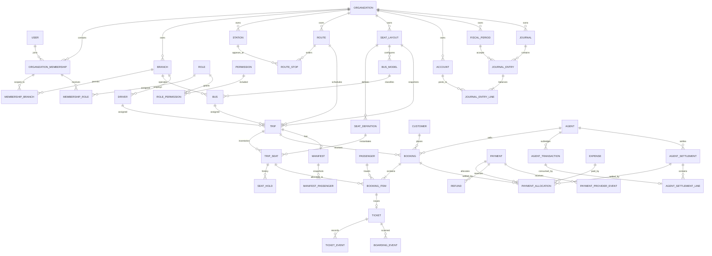

# Domain Model v1.0

## 1. حدود الـBounded Contexts

| السياق | Aggregate Roots | ما يملكه | ما لا يملكه |
|---|---|---|---|
| Identity & Access | OrganizationMembership, Role | عضوية المستخدم، الدور، Permission، Branch scope | قرارات الحجز والمال |
| Organizations | Organization, Branch | هوية الشركة، العملة والمنطقة الزمنية والفروع | Station/Route |
| Network | Station, Route | المحطات والمسار وترتيب التوقفات | الرحلات المجدولة |
| Fleet | SeatLayout, BusModel, Bus, Driver | القوالب والأصول والوثائق | Trip inventory |
| Scheduling | Trip | الجدولة، المورد، الحالة التشغيلية | الحجز والدفع |
| Seat Inventory | TripSeat, SeatHold | حالة المقعد والقفل والانتهاء | وثيقة التذكرة |
| Booking | Booking | BookingItems والتسعير snapshot | تنفيذ الدفع أو دفتر الأستاذ |
| Ticketing | Ticket | الإصدار والحالة والأحداث | Seat availability |
| Boarding | BoardingEvent | نتيجة المسح وoffline idempotency | تعديل تذكرة أو مالية دون command مصرح |
| Manifest | Manifest | Snapshot الركاب المقفول | Live booking rows بعد القفل |
| Agents | Agent, AgentSettlement | قواعد العمولة، agent subledger، التسوية | General Ledger |
| Payments | Payment, Refund | المقبوض، provider events، allocations، refunds | الاعتراف بالإيراد |
| Expenses | Expense | دورة المصروف والاعتماد | تعديل القيد بعد Post |
| Accounting | JournalEntry, FiscalPeriod | مصدر الحقيقة المالي double-entry | workflows التشغيلية |
| Platform | IdempotencyKey, OutboxEvent, AuditLog, FileAsset | الاتساق، التكامل، التدقيق والملفات | Business decisions |

## 2. قواعد الملكية

- كل Aggregate يغيّر حالته من خلال Application Command في Module المالك.
- لا Module يكتب جداول Module آخر مباشرة؛ يستخدم Port/Command أو Domain Event داخل الـMonolith.
- القراءة المركبة للتقارير مسموحة عبر Read Models/Views، ولا تمنح صلاحية الكتابة.
- `organizationId` لا يأتي من HTTP body؛ يستخرج من authenticated Membership/TenantContext.
- `branchId` المدخل يُقبل فقط بعد إثبات أنه داخل MembershipBranch scope.
- PostgreSQL هو مصدر الحقيقة؛ cache وbalance_after وdashboard أية projections قابلة لإعادة البناء.

## 3. Aggregate Invariants

### Identity

- المستخدم لا يحصل على Tenant access دون Membership ACTIVE.
- Tenant Role يجب أن ينتمي إلى نفس Organization الخاصة بالMembership.
- System Role قالب Platform ولا يُسند مباشرة إلى Membership.
- Permission grant لا يتجاوز grant ceiling للمستخدم المانح.

### Network/Fleet

- origin station لا يساوي destination station.
- RouteStop sequence فريد وموجب داخل Route.
- SeatLayout version منشورة لا تعدل؛ ينشأ version جديد.
- Bus وDriver لا يستخدمان في رحلات زمنية متداخلة.
- Trip يحتفظ بـSeatLayout snapshot reference عند إنشاء inventory.

### Trip/Inventory

- Trip لا ينتقل إلا وفق state machine المعتمدة.
- كل `(trip, seatDefinition)` ينتج TripSeat واحدًا.
- المقعد CREW/BLOCKED لا يصبح sellable.
- يوجد SeatHold ACTIVE واحد كحد أقصى للمقعد.
- انتهاء hold يقاس بوقت الخادم/DB؛ frontend timer للعرض فقط.
- شراء المقعد يتم عبر lock/conditional update، وليس read ثم write.

### Booking/Ticket

- Booking وTrip وBookingItem وTripSeat وPassenger في Organization واحدة.
- BookingItem يملك snapshot للمبلغ؛ تغيّر Fare Rule لاحقًا لا يغيره.
- مجموع Booking يساوي مجموع Items وفق سياسة rounding المعتمدة.
- لا إصدار تذكرة لحجز غير مؤكد أو رحلة ملغاة.
- Ticket واحدة فعالة لكل BookingItem؛ reissue يحفظ التاريخ ولا يمحو الوثيقة السابقة.
- التذكرة الملغاة/المستردة/المنتهية لا تقبل check-in.
- boarding success مرة واحدة؛ المحاولة المكررة Event مرفوض لا Success ثانٍ.

### Manifest

- Lock ينشئ passenger snapshot داخل نفس Transaction.
- Manifest LOCKED وصفوفه immutable.
- أي تصحيح بعد القفل عملية مستقلة ومدققة، لا UPDATE صامت.

### Payments/Refunds

- Provider event فريد عالميًا لكل `(provider, providerEventId)`.
- Payment external reference فريد عند وجوده داخل Tenant/provider.
- مجموع allocations لا يتجاوز المقبوض المكتمل.
- مجموع refunds المكتملة لا يتجاوز Payment المكتمل.
- callback وrefund command idempotentان.
- Payment ليس Revenue؛ Journal posting يحدد الأثر المحاسبي.

### Agents

- agent credit consumption وbalance checks تتم تحت lock واحد.
- AgentTransaction append-only؛ التصحيح reversal transaction.
- AgentTransaction لا يدخل أكثر من Settlement نهائي واحد.
- Settlement POSTED immutable؛ التصحيح reversal/replacement.

### Accounting

- كل Line يحتوي Debit موجبًا أو Credit موجبًا، وليس كليهما.
- كل Entry POSTED متوازن وبعملة Entry نفسها.
- Posting مسموح فقط داخل FiscalPeriod OPEN.
- Posted/Reversed entries and lines immutable.
- Reversal Entry جديد يشير إلى الأصل؛ لا تعديل للأصل.
- كل source business event ينتج قيدًا واحدًا منطقيًا عبر unique source key/idempotency.

### Platform

- AuditLog وAgentTransaction append-only.
- Idempotency key مع request hash مختلف = Conflict.
- Outbox insert وbusiness mutation وaudit insert في Transaction واحدة.
- worker يستخدم `FOR UPDATE SKIP LOCKED` ولا يعتبر الإرسال الخارجي جزءًا من transaction الأصلية.

## 4. ERD منطقي



## 5. Value Objects المطلوبة في الـDomain

- `TenantId`, `BranchId`, `MembershipId`: أنواع branded لمنع تمرير IDs عشوائية.
- `Money(amount, currency)`: Decimal فقط، جمع/طرح لنفس العملة، rounding policy مركزية.
- `Percentage`: 0..100 بدقة مستقلة عن Money.
- `DocumentNumber`: قيمة immutable مولّدة من NumberSequence.
- `TimeWindow(start, end)`: `[start,end)` مع `end > start`.
- `IdempotencyToken(key, requestHash, scope)`.
- `SeatCode`, `Email`, `Phone`, `Timezone` مع normalization/validation.
- `EncryptedIdentifier(ciphertext, blindIndex, keyVersion)` للوثائق الحساسة.

## 6. Repository Contract

غير مقبول:

```ts
findById(id: string)
```

العقد الأدنى:

```ts
findById(scope: TenantScope, id: EntityId)
```

وكل write repository يعمل داخل `UnitOfWork` يثبت على الاتصال نفسه:

```sql
SELECT set_config('app.organization_id', $1, true);
```

ثم ينفذ الاستعلامات. لا تستخدم connection pool خارج transaction بعد ضبط RLS context، ولا تستخدم `organizationId: undefined` في authorization filters.
